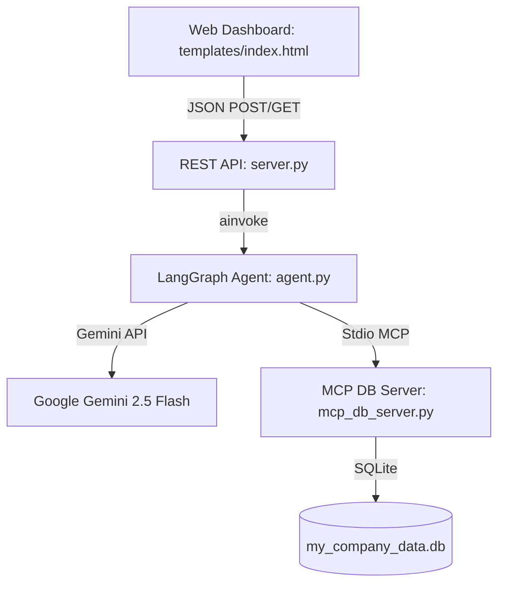

# Autonomous Omni-Channel Order Resolution Agent


An AI-powered order resolution system designed to handle customer e-commerce inquiries (status checks, cancellations, and returns) autonomously while integrating a supervisor approval queue for high-risk operations.

---

## 📖 Table of Contents
1. [Project Overview](#-project-overview)
2. [Technology Stack](#-technology-stack)
3. [System Architecture & Workflow](#-system-architecture--workflow)
4. [File & Directory Structure](#-file--directory-structure)
5. [Detailed Code & Function Breakdown](#-detailed-code--function-breakdown)
   - [server.py (Flask API & Route Handlers)](#serverpy)
   - [agent.py (LangGraph Orchestration & Nodes)](#agentpy)
   - [mcp_db_server.py (MCP Database Server & Tools)](#mcp_db_serverpy)
6. [Deployment and Usage](#-deployment-and-usage)

---

## 🌟 Project Overview

This application acts as a customer service backend and supervisor dashboard. When a customer requests a high-risk operation—such as requesting a return/refund on an item valued over $500—the system automatically pauses execution, flags the order as a pending escalation, and populates a supervisor queue. A supervisor can then review the details and either **Approve** (resuming the workflow to commit database changes) or **Decline** (cancelling the flow without mutating data) the transaction.

---

## 🛠️ Technology Stack

* **LangGraph**: Orchestrates the multi-step agent workflow with checkpointer state memory (`MemorySaver`) and conditional interrupts for supervisor approval.
* **Google Gemini LLM** (`gemini-2.5-flash`): Powers intent routing, metadata extraction (order IDs), and natural language understanding.
* **Model Context Protocol (MCP)**: Utilizes the `langchain-mcp-adapters` to bridge the LangGraph agent with a local stdio MCP server for isolated database read/write actions.
* **Flask**: Implements the REST API backend routes and serves the control center dashboard.
* **SQLite**: A local lightweight database (`my_company_data.db`) storing active order details.
* **Vanilla HTML5, CSS & JavaScript**: Responsive, dark-themed supervisor dashboard featuring live-updating escalations, user session state caching, and interactive test sandboxes.
* **Docker**: Configured with a multi-stage-like cached `Dockerfile` for standardized deployments.

---

## 🔄 System Architecture & Workflow



### End-to-End Workflow (How it Works)

Here is a step-by-step breakdown of how customer requests are handled, written in simple everyday language:

#### Step 1: The Customer Sends a Message
* **What happens**: A customer opens the dashboard website and types a request in the chatbox (for example: *"I want to check where my order ABC-123 is"* or *"I want to refund order XYZ-789"*).
* **Behind the scenes**: The web browser sends this message text over to our web server.

#### Step 2: The AI Figures Out What the Customer Wants
* **What happens**: Our web server gives the message to our AI Agent. The AI Agent talks to **Google Gemini** (the Brain) to understand two things:
  1. **What is the goal?** (e.g., Is the customer asking for order tracking, requesting a cancellation, or wanting a refund?)
  2. **Is there an Order ID?** (e.g., Did they mention an ID like `XYZ-789`?)

#### Step 3: Checking the Database
* **What happens**: Once the AI knows the Order ID, it uses a secure database connection helper (the **MCP Database Server**) to look up the order in our database. It fetches information like:
  * What item was purchased?
  * How much did it cost?
  * Is it unshipped, shipped, or already delivered?
  * How many days ago was it delivered?

#### Step 4: Applying Rules and Checking Risk
* **What happens**: The system checks the database information against our store policies:
  * **Checking Status**: If they just want to see where their order is, the AI immediately replies with the status (e.g. *"Delivered 5 days ago"*).
  * **Cancellations**: If they want to cancel, the system checks if the order has shipped. If it has **not** shipped, the cancellation is marked as **Low Risk** and goes through automatically. If it has already shipped, the system tells them it's too late to cancel and redirects them to request a return.
  * **Returns & Refunds**: 
    * If the order was delivered **more than 30 days ago**, the return is **automatically rejected** (per store policy).
    * If the item is valued **under $500** (e.g., a $45 yoga mat), the return is considered **Low Risk** and processed automatically.
    * If the item is valued **over $500** (e.g., a $1,499 television), this is flagged as **High Risk**. 

#### Step 5: Pausing for Supervisor Review (For High-Risk Actions)
* **What happens**: For any **High-Risk** action (like refunding that $1,499 TV), the AI is **not allowed** to finish the refund on its own. 
* **Behind the scenes**: The system freezes the AI conversation in place (putting it on "hold"). It creates a pending ticket and displays it on the supervisor's dashboard under **Supervisor Escalations**.

#### Step 6: Supervisor Decision (Approve or Decline)
* **What happens**: A manager looks at the supervisor screen, reviews the order details, and makes a decision:
  * **If Approved**: The supervisor clicks "Approve". The server unfreezes the AI. The AI runs its final step, updates the database status to `"returned"`, and replies to the customer: *"Return processed successfully. Refund initiated."*
  * **If Declined**: The supervisor clicks "Decline". The server tells the AI the request was rejected. The AI replies to the customer: *"Your request has been declined by a manager."* The database remains unchanged (the order status stays as `"delivered"`), and the customer is not refunded.


---

## 📁 File & Directory Structure

```text
├── .dockerignore          # Configures files excluded from the Docker build context
├── .env                  # Configuration for API keys and environment variables
├── Dockerfile             # Container definition for application deployment
├── README.md              # Project documentation (this file)
├── agent.py               # LangGraph agent definitions, routing, and node policies
├── mcp_db_server.py       # Stdio-based FastMCP server executing SQLite operations
├── my_company_data.db     # SQLite database containing order tracking records
├── requirements.txt       # Python package dependencies
├── server.py              # Flask server hosting endpoints and rendering dashboard
├── templates/
│   └── index.html         # Rich UI Frontend Dashboard & Client JS Controller
└── walkthrough.md         # Architecture documentation and manual testing guide
```

---

## 🔍 Detailed Code & Function Breakdown

### [`server.py`](file:///c:/Users/Sweekriti%20Keshari/Downloads/Projects/Autonomous%20Omni-Channel%20Order%20Resolution%20Agent/server.py)
This is the entrypoint server hosting the web application and API endpoints.

* **`index()`**
  * **Description**: Serves the main UI control dashboard page (`index.html`).
  * **HTTP Method**: `GET /`
* **`chat()`**
  * **Description**: Receives chat input from customers, routes it through the LangGraph state machine, monitors for supervisor escalation interrupts, and updates the chat log.
  * **HTTP Method**: `POST /api/chat`
* **`get_escalations()`**
  * **Description**: Returns all currently pending supervisor escalations populated with real-time metadata (item names, values, risk scores) fetched from SQLite.
  * **HTTP Method**: `GET /api/escalations`
* **`approve_escalation()`**
  * **Description**: Resumes the paused state checkpointer of the LangGraph agent for the specific user session thread. It updates the state variables to set `risk_score=0.0` and `resolution_status="approved"`, which forces the graph to run the commit node.
  * **HTTP Method**: `POST /api/approve`
* **`decline_escalation()`**
  * **Description**: Declines the escalation request. It injects a manager decline message into the agent state, sets `resolution_status="completed"` (bypassing the database write node), and removes the order from the pending queue.
  * **HTTP Method**: `POST /api/decline`

---

### [`agent.py`](file:///c:/Users/Sweekriti%20Keshari/Downloads/Projects/Autonomous%20Omni-Channel%20Order%20Resolution%20Agent/agent.py)
Handles the conversational memory, agent graph routing, policies, and LLM interfaces.

* **`router_node(state)`**
  * **Description**: Analyzes the customer's text request using Gemini structured output and extracts the user's target `intent` and `order_id` (if present).
* **`process_cancel_node(state)`**
  * **Description**: Evaluates cancellation policies. Calls the MCP server to verify if the item has already shipped. If unshipped, sets `risk_score=0.1`. If shipped, reroutes to the returns node automatically.
* **`process_return_node(state)`**
  * **Description**: Evaluates return eligibility. Checks if the delivery age is within the 30-day cap window. If it is, returns a `risk_score` based on item value ($500+ items get flagged as `risk_score=0.8` high-risk, triggering a supervisor interrupt).
* **`general_status_node(state)`**
  * **Description**: A read-only node that queries order status over the MCP server link and provides tracking info back to the customer.
* **`risk_and_commit_node(state)`**
  * **Description**: The final database-mutating node. Calls the MCP tools (`cancel_order` or `return_order`) to update SQLite values once risk validation passes or supervisor approval is granted.
* **`route_intent_condition(state)`**
  * **Description**: Conditional routing edge that directs the graph to `cancel_order`, `return_refund`, or `order_status` branches based on the router node's findings.
* **`route_risk_condition(state)`**
  * **Description**: Conditional routing edge that decides whether to proceed to `risk_and_commit` or stop (`END`) depending on if the resolution status has finished or was rejected.

---

### [`mcp_db_server.py`](file:///c:/Users/Sweekriti%20Keshari/Downloads/Projects/Autonomous%20Omni-Channel%20Order%20Resolution%20Agent/mcp_db_server.py)
An isolated Model Context Protocol (MCP) server utilizing FastMCP. It exposes SQLite functions as standard MCP tools.

* **`get_db_connection()`**
  * **Description**: Returns a standard `sqlite3` connection configured to return dictionaries for SQL rows.
* **`verify_existing_database()`**
  * **Description**: Runs on startup to verify the database file exist and contains the required `orders` table structure.
* **`get_order_details(order_id)`**
  * **Description**: [MCP Tool] Fetches and returns all fields for a specified order ID as JSON.
* **`list_all_orders()`**
  * **Description**: [MCP Tool] Returns a summary list of all orders stored in the database.
* **`cancel_order(order_id)`**
  * **Description**: [MCP Tool] Modifies SQLite state. Cancels an order and refunds it if the status is currently `unshipped`.
* **`return_order(order_id)`**
  * **Description**: [MCP Tool] Modifies SQLite state. Returns a delivered item and refund if days since delivery is less than or equal to 30.
* **`simulate_days_since_delivery(order_id, days)`**
  * **Description**: [MCP Tool] Test utility allowing developers or agents to adjust delivery date offsets in SQLite.

---

## 🚀 Deployment and Usage

### Local Execution
1. Activate the environment:
   ```powershell
   .venv\Scripts\activate
   ```
2. Launch the Flask API server:
   ```bash
   python server.py
   ```
3. Open the dashboard at `http://127.0.0.1:5000/`.

### Containerized Deployment
1. Build the Docker image:
   ```bash
   docker build -t order-resolution-agent .
   ```
2. Run the container:
   ```bash
   docker run -d -p 5000:5000 --env-file .env --name order-agent order-resolution-agent
   ```
