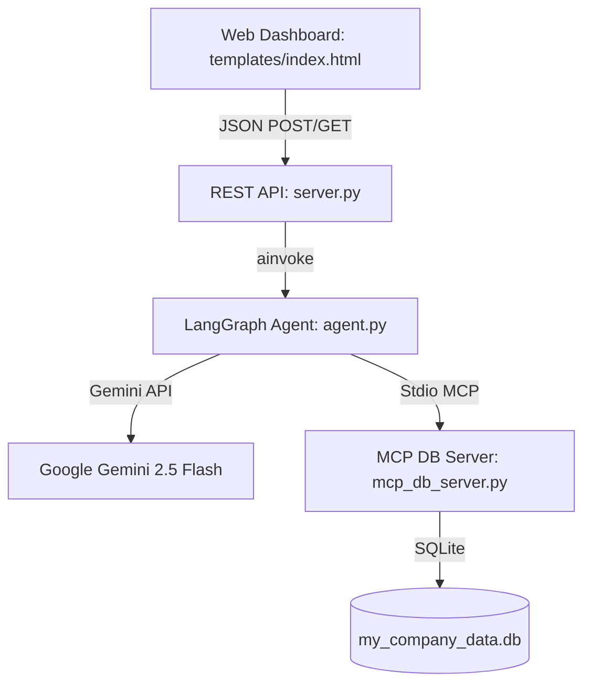

# Project Walkthrough - REST API Backend with Web Frontend Dashboard

We have successfully replaced the WhatsApp Business Cloud API integration with a standard, channel-agnostic REST API and a beautiful web dashboard frontend.

---

## 1. System Architecture Diagram



---

## 2. API Endpoints Exposes (`server.py`)

* **`GET /`**: Serves the user interface dashboard page (`index.html`).
* **`POST /api/chat`**: Receives customer text input, routes it through the LangGraph agent, and returns the response. If high risk, pauses execution and flags the order as pending approval.
* **`GET /api/escalations`**: Queries details from SQLite and returns a list of all order return requests currently pending manager audit.
* **`POST /api/approve`**: Updates checkpointer state to approved (`risk_score=0.0`, `resolution_status="approved"`), resumes the graph to commit changes in SQLite, and returns the success message.
* **`POST /api/decline`**: Updates checkpointer state directly to completed (`resolution_status="completed"`) with a manager decline message, and clears the escalation queue.

---

## 3. Web Dashboard UI (`templates/index.html`)

A beautiful, dark-themed control center featuring:
* **Customer Chat Sandbox (Left)**: Allows testing the agent dynamically. A dropdown lets you switch between different customer profiles (`cust_alpha`, `cust_beta`, `cust_gamma`, `cust_delta`) with independent conversation threads preserved in memory.
* **Supervisor Escalations Queue (Right)**: Shows real-time pending approvals. Displays full metadata (Order ID, Item Name, Price, Days Since Delivery, and Risk Score) and includes single-click **Approve** and **Decline** buttons with micro-animations. It polls `/api/escalations` every 3 seconds to keep itself synchronized.

---

## 4. Test Suite Results (`test_api.py`)

We verified the complete workflow using the integration test suite [test_api.py](file:///C:/Users/Sweekriti%20Keshari/.gemini/antigravity-ide/brain/4b8f9d61-abe3-4d66-9a89-03d34018cdbb/scratch/test_api.py):

```
Backing up database...

--- Step 1: Verify Index Route ---
PASSED: Index page loaded successfully.

--- Step 2: Customer checks order status (ABC-123) ---
Chat response: {'response': 'Status for order ABC-123: CANCELLED. Delivered 0 days ago.', 'status': 'completed'}
PASSED: Low risk read-only request completed automatically.

--- Step 3: Customer requests return for high-value order XYZ-789 ---
Chat response: {'order_id': 'XYZ-789', 'response': 'CRITICAL AUDIT: High transaction value flags system risk rules. Halting execution and transferring to a supervisor.', 'status': 'pending_approval'}
Pending Escalations: [{'customer_id': 'cust_test_2', 'days_since_delivery': 15, 'fulfillment_status': 'delivered', 'item_name': 'Premium 4K OLED Television', 'item_value': 1499.0, 'order_id': 'XYZ-789', 'risk_score': 0.8}]
PASSED: High value return correctly suspended for review.

--- Step 4: Supervisor approves order XYZ-789 ---
Approval response: {'response': 'Success! Success: Return processed for order XYZ-789. Refund initiated.', 'status': 'success'}
Verified XYZ-789 status in DB: returned
PASSED: Supervisor approval mutated database and cleared queue.

--- Step 5: Test Decline Flow ---
Decline response: {'response': 'Your request for order XYZ-789 has been declined by a manager.', 'status': 'success'}
Verified XYZ-789 status in DB after decline: delivered
PASSED: Supervisor decline resolved the queue without DB mutation.

Restoring database...
Database restored successfully.
```

---

## 5. How to Run Locally

1. **Activate the Virtual Environment**:
   ```powershell
   .venv\Scripts\activate
   ```
2. **Start the REST API Server**:
   ```bash
   python server.py
   ```
3. **Open the Dashboard**:
   Go to **`http://127.0.0.1:5000/`** in your browser.

---

## 6. How to Deploy using Docker

We have created a [`Dockerfile`](file:///c:/Users/Sweekriti%20Keshari/Downloads/Projects/Autonomous%20Omni-Channel%20Order%20Resolution%20Agent/Dockerfile) and a [`.dockerignore`](file:///c:/Users/Sweekriti%20Keshari/Downloads/Projects/Autonomous%20Omni-Channel%20Order%20Resolution%20Agent/.dockerignore) to make containerized deployment simple.

### Build the Docker Image
To build the container image, run the following command from the project root:
```bash
docker build -t order-resolution-agent .
```

### Run the Docker Container
To run the container, forwarding port `5000` and loading the environment variables (like your LLM API keys):
```bash
docker run -d -p 5000:5000 --env-file .env --name order-agent order-resolution-agent
```

Once running, you can access the dashboard at **`http://localhost:5000/`**.
